# DataFlowX
### End-to-End Azure Data Engineering Pipeline for E-Commerce Analytics

<div align="center">


**Production-ready data pipeline implementing Medallion Architecture on Azure Cloud**

[View Architecture](#-architecture) • [Tech Stack](#-technology-stack) • [Quick Start](#-quick-start)

</div>

---

## 📋 Executive Summary

DataFlowX is an **enterprise-grade data engineering solution** built on Microsoft Azure, processing 1.3M+ records from Brazilian e-commerce transactions. The pipeline implements industry-standard **Medallion Architecture** (Bronze/Silver/Gold layers) to transform raw data into actionable business insights.

### Business Value Delivered
- ⚡ **Scalable Processing**: Distributed computing with Apache Spark handles growing data volumes
- 🔄 **Multi-Source Integration**: Unified pipeline ingesting from HTTP, SQL, and NoSQL sources
- 📊 **Analytics-Ready Data**: Clean, enriched datasets optimized for BI consumption
- 🏗️ **Production Standards**: Follows Azure best practices with proper error handling and monitoring

### Technical Highlights
| Feature | Implementation |
|---------|----------------|
| **Architecture** | Medallion (Bronze → Silver → Gold) with data quality layers |
| **Data Volume** | 1.3M+ records across 9 datasets |
| **Processing Engine** | Azure Databricks with PySpark |
| **Orchestration** | Azure Data Factory with automated pipelines |
| **Storage** | Azure Data Lake Gen2 with optimized partitioning |
| **Analytics** | Azure Synapse Analytics with external tables |

---

## 🏗️ Architecture

<div align="center">
  
</div>

### Pipeline Flow: Data Journey from Source to Insights

```mermaid
graph LR
    A[Data Sources] --> B[Azure Data Factory]
    B --> C[Bronze Layer - Raw]
    C --> D[Databricks - Transform]
    D --> E[Silver Layer - Cleaned]
    E --> F[Databricks - Aggregate]
    F --> G[Gold Layer - Analytics]
    G --> H[Azure Synapse]
    H --> I[Power BI]
    
    style A fill:#f9f,stroke:#333
    style G fill:#ffd700,stroke:#333
    style I fill:#0078D4,stroke:#333
```



### Data Layer Architecture

| Layer | Purpose | Technology | Data State |
|:-----:|---------|------------|------------|
| 🔵 **Bronze** | Raw data ingestion | Azure Data Lake Gen2 | Unprocessed, original schema |
| 🥈 **Silver** | Data cleansing & enrichment | Azure Databricks + PySpark | Validated, deduped, standardized |
| 🥇 **Gold** | Business aggregations | Azure Databricks + Synapse | Analytics-ready metrics |

---

## 🛠️ Technology Stack

### Core Azure Services

<table>
<tr>
<td align="center" width="25%">

<br><strong>Azure Data Factory</strong>
<br><sub>ETL Orchestration</sub>
</td>
<td align="center" width="25%">

<br><strong>Azure Databricks</strong>
<br><sub>Spark Processing</sub>
</td>
<td align="center" width="25%">

<br><strong>Azure Data Lake Gen2</strong>
<br><sub>Scalable Storage</sub>
</td>
<td align="center" width="25%">

<br><strong>Azure Synapse</strong>
<br><sub>Analytics Engine</sub>
</td>
</tr>
</table>

### Data Sources & Processing

| Component | Technology | Purpose |
|-----------|------------|---------|
| **NoSQL Database** | MongoDB Atlas | Category enrichment & translation |
| **Relational Database** | MySQL | Order payments & transactions |
| **Batch Processing** | Apache Spark (PySpark) | Distributed data transformation |
| **Languages** | Python 3.8+, SQL | Scripting & query development |
| **Visualization** | Power BI | Business intelligence dashboards |

---

## 📊 Dataset Overview

**Source**: Olist Brazilian E-Commerce Public Dataset  
**Period**: 2016-2018 | **Total Records**: 1.3M+ | **Format**: CSV

### Data Schema

<table>
<tr>
<td width="50%">

**📦 Orders & Transactions**
- `olist_orders_dataset` (99,441 records)
- `olist_order_items_dataset` (112,650 records)
- `olist_order_payments_dataset` (103,886 records)
- `olist_order_reviews_dataset` (99,224 records)

</td>
<td width="50%">

**👥 Entities & Locations**
- `olist_customers_dataset` (99,441 records)
- `olist_sellers_dataset` (3,095 records)
- `olist_products_dataset` (32,951 records)
- `olist_geolocation_dataset` (1M+ records)

</td>
</tr>
</table>

**Enrichment Data**: Product category translations (Portuguese → English) via MongoDB

---

## 🚀 Quick Start

### Prerequisites

- Azure subscription (Free tier eligible)
- Python 3.8+
- Git
- MongoDB Atlas account (Free tier)
- MySQL database access

### Setup Instructions

**1. Clone Repository**
```bash
git clone https://github.com/siddharths060/DataFlowX.git
cd DataFlowX
```

**2. Azure Resource Provisioning**
```bash
# Authenticate
az login

# Create resource group
az group create --name DataFlowX-RG --location eastus

# Deploy Data Lake Storage
az storage account create \
  --name dataflowxstorage \
  --resource-group DataFlowX-RG \
  --sku Standard_LRS \
  --kind StorageV2 \
  --hierarchical-namespace true
```

**3. Configure Database Connections**

Update `Database/connect_to_database.py`:
```python
hostname = "your-mysql-host"
database = "your-database-name"
username = "your-username"
password = "your-password"
```

**4. Deploy Pipeline**
- Upload CSV files from `Data/` to Bronze container in ADLS Gen2
- Import ADF pipelines for automated ingestion
- Configure Databricks notebooks for transformations
- Set up Synapse external tables for analytics layer

---

## 📂 Project Structure

```
DataFlowX/
│
├── 📁 Data/                                    # Raw e-commerce datasets
│   ├── olist_customers_dataset.csv
│   ├── olist_orders_dataset.csv
│   ├── olist_order_items_dataset.csv
│   ├── olist_order_payments_dataset.csv
│   ├── olist_order_reviews_dataset.csv
│   ├── olist_products_dataset.csv
│   ├── olist_sellers_dataset.csv
│   ├── olist_geolocation_dataset.csv
│   └── product_category_name_translation.csv
│
├── 📁 Database/                                # Database connection scripts
│   ├── connect_to_database.py              # MySQL connection test
│   └── add_table_and_values_to_database.py # Batch data upload utility
│
├── 📄 README.md                                # Project documentation
└── 📄 LICENSE                                  # MIT License
```

---

## 🔄 Pipeline Workflow

<div align="center">

### **Bronze → Silver → Gold Transformation Journey**

</div>

<br>

### **Step 1: Data Ingestion** 🔵
<table>
<tr>
<td width="30%">

**Tool**: Azure Data Factory

</td>
<td width="70%">

```
Data Sources → ADF Pipelines → Bronze Layer (ADLS Gen2)
```
- HTTP connector for GitHub CSV files
- SQL connector for MySQL database  
- MongoDB connector for enrichment data

</td>
</tr>
</table>

### **Step 2: Bronze → Silver Transformation** 🥈
<table>
<tr>
<td width="30%">

**Tool**: Azure Databricks

</td>
<td width="70%">

```python
# Sample PySpark transformation
from pyspark.sql import functions as F

# Read from Bronze
df_orders = spark.read.parquet("/mnt/bronze/orders")

# Clean and transform
df_cleaned = df_orders \
    .dropDuplicates() \
    .na.drop() \
    .withColumn("order_date", F.to_date("order_purchase_timestamp")) \
    .withColumn("delivery_delay", 
                F.datediff("order_delivered_customer_date", 
                          "order_estimated_delivery_date"))

# Write to Silver
df_cleaned.write.mode("overwrite").parquet("/mnt/silver/orders")
```

</td>
</tr>
</table>

### **Step 3: Data Enrichment** 🍃
<table>
<tr>
<td width="30%">

**Tool**: MongoDB Integration

</td>
<td width="70%">

- Join product data with category translations
- Convert Portuguese categories to English
- Standardize naming conventions

</td>
</tr>
</table>

### **Step 4: Silver → Gold Aggregation** 🥇
<table>
<tr>
<td width="30%">

**Tool**: Azure Databricks

</td>
<td width="70%">

```python
# Calculate business metrics
order_metrics = df_orders \
    .groupBy("order_status", "customer_state") \
    .agg(
        F.count("order_id").alias("total_orders"),
        F.avg("delivery_delay").alias("avg_delay_days"),
        F.sum("payment_value").alias("total_revenue")
    )

# Write to Gold layer
order_metrics.write.mode("overwrite").parquet("/mnt/gold/order_metrics")
```

</td>
</tr>
</table>

### **Step 5: Serving Layer** 📊
<table>
<tr>
<td width="30%">

**Tool**: Azure Synapse

</td>
<td width="70%">

```sql
-- Create external table in Synapse
CREATE EXTERNAL TABLE gold.order_metrics
WITH (
    LOCATION = '/gold/order_metrics/',
    DATA_SOURCE = AzureDataLake,
    FILE_FORMAT = ParquetFormat
);
```

</td>
</tr>
</table>

---

## 📈 Business Insights

<div align="center">

### 💡 **Analytics Capabilities Unlocked**

</div>

<br>

<table>
<tr>
<td width="50%" align="center">

### 📦 **Order Analytics**


✅ Delivery performance tracking  
✅ Order status distribution  
✅ Peak ordering periods  
✅ Fulfillment time analysis

</td>
<td width="50%" align="center">

### 👥 **Customer Insights**


✅ Geographic distribution  
✅ Satisfaction scores  
✅ Repeat customer analysis  
✅ Review sentiment trends

</td>
</tr>
<tr>
<td width="50%" align="center">

### 💰 **Financial Metrics**


✅ Revenue by category  
✅ Payment method preferences  
✅ Installment payment trends  
✅ Average order value

</td>
<td width="50%" align="center">

### 🏪 **Operational Excellence**


✅ Seller performance rankings  
✅ Delivery delay analysis  
✅ Inventory turnover rates  
✅ Logistics optimization

</td>
</tr>
</table>

---

## 🎓 Skills Demonstrated

<div align="center">

| Category | Technologies & Concepts |
|:--------:|-------------------------|
| ☁️ **Cloud Engineering** | Azure Data Factory • Azure Databricks • Azure Synapse • ADLS Gen2 |
| 📊 **Big Data** | Apache Spark • PySpark • Distributed Computing • Partitioning |
| 🏗️ **Architecture** | Medallion Pattern • Data Lake Design • ETL/ELT Pipelines |
| 🔄 **Integration** | Multi-source Ingestion • HTTP/SQL/NoSQL Connectors • Data Enrichment |
| 📐 **Data Modeling** | Dimensional Modeling • Star Schema • Analytics Tables |
| 💻 **Programming** | Python • SQL • PySpark • Shell Scripting |
| 🔧 **DevOps** | CI/CD Ready • Infrastructure as Code • Version Control |

</div>

---

## 📚 Resources & Documentation

# Clean and transform
df_cleaned = df_orders \
    .dropDuplicates() \
    .na.drop() \
    .withColumn("order_date", F.to_date("order_purchase_timestamp")) \
    .withColumn("delivery_delay", 
                F.datediff("order_delivered_customer_date", 
                          "order_estimated_delivery_date"))

# Write to Silver
df_cleaned.write.mode("overwrite").parquet("/mnt/silver/orders")
```

### Step 3: Data Enrichment (MongoDB Integration)
- Join product data with category translations
- Standardize category names from Portuguese to English

### Step 4: Analytics Aggregation (Silver → Gold)
```python
# Calculate business metrics
---

## 🔄 Pipeline Workflow

### Bronze → Silver → Gold Transformation

#### **Stage 1: Data Ingestion (Bronze Layer)**
```
Multi-Source → Azure Data Factory → Bronze Layer (ADLS Gen2)
```
- HTTP connector: GitHub CSV files
- SQL connector: MySQL transactional data
- NoSQL connector: MongoDB enrichment data

#### **Stage 2: Data Cleansing (Silver Layer)**

```python
# PySpark transformation example
from pyspark.sql import functions as F

# Read raw data
df_orders = spark.read.parquet("/mnt/bronze/orders")

# Clean and standardize
df_cleaned = (df_orders
    .dropDuplicates()
    .na.drop()
    .withColumn("order_date", F.to_date("order_purchase_timestamp"))
    .withColumn("delivery_delay_days", 
                F.datediff("order_delivered_customer_date", 
                          "order_estimated_delivery_date")))

# Write to Silver
df_cleaned.write.mode("overwrite").parquet("/mnt/silver/orders")
```

**Key Operations**: Deduplication • Null handling • Type standardization • Data validation

#### **Stage 3: Data Enrichment**
- Join with MongoDB for category translations (PT → EN)
- Standardize product categorization
- Apply business rules and calculated fields

#### **Stage 4: Business Aggregations (Gold Layer)**

```python
# Calculate KPIs
order_metrics = (df_orders
    .groupBy("order_status", "customer_state")
    .agg(
        F.count("order_id").alias("total_orders"),
        F.avg("delivery_delay_days").alias("avg_delivery_delay"),
        F.sum("payment_value").alias("total_revenue")
    ))

df_cleaned.write.mode("overwrite").parquet("/mnt/silver/orders")
```

### Step 3: Data Enrichment (MongoDB Integration)
- Join product data with category translations
- Standardize category names from Portuguese to English

### Step 4: Analytics Aggregation (Silver → Gold)
```python
# Calculate business metrics
order_metrics.write.mode("overwrite").parquet("/mnt/gold/order_metrics")
```

**Metrics Generated**: Order volume • Revenue analysis • Delivery performance • Customer satisfaction

#### **Stage 5: Analytics Serving (Synapse)**

```sql
-- Create external table
CREATE EXTERNAL TABLE gold.order_metrics
WITH (
    LOCATION = '/gold/order_metrics/',
    DATA_SOURCE = AzureDataLake,
    FILE_FORMAT = ParquetFormat
);
```

---

## 📈 Business Insights & Analytics

### Key Performance Indicators

<table>
<tr>
<td width="50%">

**📦 Operational Metrics**
- Order fulfillment rates
- Average delivery time vs. estimates
- On-time delivery percentage
- Order status distribution

**💰 Financial Analytics**
- Revenue by product category
- Payment method distribution
- Installment payment trends
- Average order value by region

</td>
<td width="50%">

**👥 Customer Analytics**
- Geographic customer distribution
- Customer satisfaction scores (reviews)
- Repeat purchase analysis
- Customer lifetime value segments

**🏪 Seller Performance**
- Top-performing sellers by revenue
- Seller delivery performance rankings
- Product category performance
- Inventory turnover rates

</td>
</tr>
</table>

---

## 💼 Skills & Competencies Demonstrated

| Category | Technologies & Concepts |
|----------|------------------------|
| **Cloud Engineering** | Azure Data Factory • Azure Databricks • Azure Synapse Analytics • ADLS Gen2 |
| **Big Data Processing** | Apache Spark • PySpark • Distributed Computing • Data Partitioning |
| **Data Architecture** | Medallion Architecture • Data Lake Design • ETL/ELT Patterns |
| **Data Integration** | Multi-source Ingestion • HTTP/SQL/NoSQL Connectors • Data Enrichment |
| **Data Modeling** | Dimensional Modeling • Star Schema • Analytics Tables |
| **Programming** | Python • SQL • PySpark • Shell Scripting |
| **Best Practices** | Data Quality Management • Error Handling • Performance Optimization |

---

## 📁 Project Structure

```
DataFlowX/
│
├── 📂 Data/                           # Source datasets (CSV)
│   ├── olist_customers_dataset.csv
│   ├── olist_orders_dataset.csv
│   ├── olist_order_items_dataset.csv
│   ├── olist_order_payments_dataset.csv
│   ├── olist_order_reviews_dataset.csv
│   ├── olist_products_dataset.csv
│   ├── olist_sellers_dataset.csv
│   ├── olist_geolocation_dataset.csv
│   └── product_category_name_translation.csv
│
├── 📂 Database/                       # Database utilities
│   ├── connect_to_database.py        # MySQL connection module
│   └── add_table_and_values_to_database.py  # Batch upload utility
│
├── 📄 README.md
└── 📄 LICENSE
```

---

## 📚 References & Documentation

[](https://docs.microsoft.com/azure/data-factory/)
[](https://docs.microsoft.com/azure/databricks/)
[](https://docs.microsoft.com/azure/synapse-analytics/)
[](https://docs.databricks.com/lakehouse/medallion.html)

---

## 🤝 Contributing

Contributions are welcome! Please feel free to submit a Pull Request.

1. Fork the repository
2. Create your feature branch (`git checkout -b feature/Enhancement`)
3. Commit your changes (`git commit -m 'Add new feature'`)
4. Push to the branch (`git push origin feature/Enhancement`)
5. Open a Pull Request

---

## 📄 License

This project is licensed under the MIT License - see the [LICENSE](LICENSE) file for details.

---

## 👤 Author

**Siddharth Sharma**

[](https://github.com/siddharths060)
[](https://linkedin.com/in/siddharths060)

---

<div align="center">

### Built with Microsoft Azure


**© 2025 DataFlowX** • *Enterprise Data Engineering on Azure Cloud*

</div>
